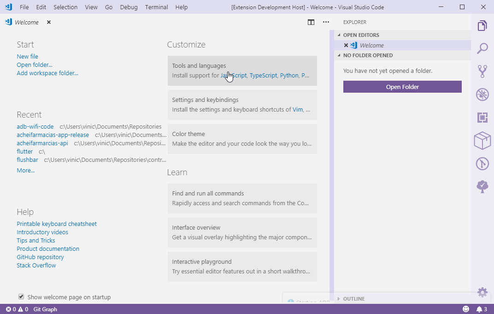

# ADB Interface for VSCode

> ⚠️ WARN !! ONLY TESTED IN WINDOWS !! (For while, you must have ADB at your Enviroment Variables)

This are an simple ADB-Wrapper that makes possible to connect to an device over wifi connection without console use.

Help are welcome ;)

You can contribute with
[Code](https://github.com/vinicioslc/adb-interface-vscode)
or
[Energy](https://www.paypal.com/cgi-bin/webscr?cmd=_s-xclick&hosted_button_id=TKRZ7F4FV4QY4&source=url)

[简体中文指南](https://www.jianshu.com/p/fb8eebc8a2c0)

## Features Todo/Done

-   ☒ Kill ADB server

    ☒ Kills the adb server and all current connections

-   ☐ ADB Resolver - Find and resolve ADB Location

    ☒ Use default `ADB` in Enviroment Variable

    ☐ Try Find Android Studio `ADB` in `platform-tools` folder

    ☐ When not founded `ADB` download `platform-tools` to `Android Studio` default folder

## How to connect my phone via wifi

1.  First connect your device trough USB
2.  Run `ADB:📱 Disconnect from any devices`
3.  And run `ADB:📱 Reset connected devices port to :5555`
4.  And Then `ADB:📱 Connect to device IP` enter your device (settings > status > ip address) IP address and be fine

### Tests Health Summary by jest-badge-generator

## Available Commands

-   ADB:📱 Reset connected devices port to :5555 (Open current device port with `adb tcpip 5555`)
-   ADB:📱 Connect to device IP (need inform IP from device wanted `adb connect ${user_ip}:5555`)
-   ADB:📱 Disconnect from any devices (Disconnect ever device attached `adb disconnect`)
-   ADB:📱 Connect to device from List (Show an list from devices attached to connect)
-   ADB:🔥 Enable Firebase events debug mode (Run firebase events in debug mode)
-   ADB:🔥 Disable Firebase events debug mode (Run firebase events in debug mode)
-   ADB:⚠️ Kill ADB server (Kill ADB Server runing `adb kill-server`)
